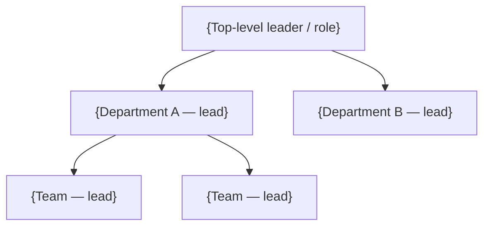

# Organization — {Project Name}

How the organization is structured: departments, teams, vendors, and the
dynamics between them. "Unknown" indicates the information wasn't stated
in the source.

---

<!-- Include the two sections below ONLY if the file has material
     uncertainty. Omit entirely if everything is well-grounded. -->

## Open Questions

Group by sub-theme if there are many.

### Overall Structure
- {Question}

### Teams
- {Question}

### Vendor Details
- {Question}

## Validation Recommended

| Item | Field(s) to Validate | Why |
|---|---|---|
| {Org element or claim} | {Inferred reporting line / vendor scope / dynamic / etc.} | {Why it needs validation} |

---

## Org Chart

<!-- Use solid arrows for confirmed reporting lines. Use dashed arrows
     (-.->) for inferred or uncertain lines, and call them out in
     Validation Recommended. -->

---

## Internal Departments

### {Department Name}

- **Lead:** {Name} ({Title or unknown})
- **Scope:** {What this department owns}
- **Sub-teams / functions:** {List}
- **Key dynamics:** {Cross-team relationships, friction points, etc.}

<!-- Repeat per department. -->

---

## External Vendors

| Vendor | What They Provide | Primary Contact | Contract / Status | Notes |
|---|---|---|---|---|
| {Vendor} | {Scope of work} | {Name or unknown} | {Active / expiring / unknown} | {Notes} |

---

## How the Business Operates

Narrative section capturing how the org actually functions day-to-day:
- Decision-making patterns
- Recurring rituals or forums
- Known friction points / blockers
- Cultural or operational norms worth knowing

Keep this evidence-based — tie observations back to specific source
statements. If a dynamic is inferred rather than stated, flag it in
Validation Recommended.

---

## Conventions

- Mermaid chart should reflect the source's stated structure first;
  inferred lines should be dashed and noted.
- Vendors and internal teams live in separate sections — don't mix.
- Use `unknown` for any unstated field.
