# Organization — TPCi (The Pokemon Company International)

A breakdown of how TPCi (specifically the D2C / AR / PCEN side of the business) is organized and operates, including internal departments, vendor relationships, and the broader operating dynamics surfaced during onboarding.

---

## Open Questions

Items the source notes do not answer; recommend asking during follow-up conversations.

### Overall Structure
- What is the exact relationship between **CELA** and **PCEN**? Source uses both terms — CELA appears to be the broader engineering/dev org and PCEN appears to be the Pokemon Center commerce product, but the formal relationship and reporting lines are not stated.
- Who do Cindy and Stefan report to above the D2C level?
- Is there a formal "D2C Leadership" entity above Cindy and Stefan, or are they peers reporting independently into TPCi exec?
- Where does **BizApps** sit organizationally — under Cindy, under another exec, or as its own org?
- Where does **InfoSec** sit organizationally, and who leads it?
- Where does **Treasury** sit (other than including Bryan)?
- Where does **Legal** sit, and who leads it?
- Where does **Manufacturing** sit relative to AR — is Zach actually under Stefan, or in a separate Operations/Supply Chain org?
- What is **Leon's** team's actual department/charter?
- Who are the leaders of **Sales / International Sales / TCG Sales** referenced as putting pressure on Stefan?

### Teams
- What is the size of the AR Tech team beyond Alex Doumani? (Alphonse referenced as outgoing; no other names.)
- What is the size of the NetOps team beyond Joe Stutzman?
- What is the size of the Manufacturing team beyond Zach Dizard?
- What is the size of Rory Fisher's combined Merchandizing/SalesOps/Install/Logistics org beyond Tom Lindley?
- How large is Olga's Mulesoft ("Mudbray") team?
- How many people are on the PIM/Enterworks team beyond James and Mike?
- How many people are on the CDP/Analytics team beyond Simon and Rohit?
- How many people work in CS beyond Holly and the 3 dedicated ModSquad agents?
- Who else is on Steve Yin's incoming AR Business Manager / Bizops team?

### Vendor Details
- T-ROC mgmt team headcount funded by TPCi: source says **10** in one spot and **12** in another — which is current?
- Who are the named vendor-side contacts at Vendnovation (only "2 leads — one backend, one client" mentioned without names)?
- Who are the vendor-side contacts at VML/Gorilla, Hillman, T-ROC, Brendamoor, Flextronics, DragonMan/CDI, TPGI, RSI, ModSquad?
- What is the relationship between TPCi and ModSquad — direct contract via CELA? Through Holly?
- What is the contractual structure with VML — fixed-price, T&M, retainer? Source says "6-month PO" but contract type unclear.
- Status of the **Excel Marketing** acquisition (TPCi has an offer out — accepted? pending?).

---

## Validation Recommended

Records where details are present but inferred rather than directly stated; please confirm.

| Area | Inferred Detail | Why It Should Be Validated |
|---|---|---|
| **Cindy** | "D2C / CELA Leader" | Source says she "oversees CELA dev org" and is sponsor of AR/PCEN integration; the exact title is inferred |
| **Stefan / Cindy peer relationship** | Both report into TPCi exec as peers | Inferred from kickoff context; not explicit |
| **AR org structure** | Alex, Joe, Zach, Rory, Steve all report to Stefan | "6 different ops areas in AR" is confirmed in source (line 1674), and Rory/Joe/Zach are confirmed as leads — but direct reporting to Stefan is inferred |
| **CELA org structure** | Kevin, Liz, Olga, James, Simon, Holly, Midori all roll up under Cindy | Inferred from context; not explicitly mapped |
| **Yannick's team placement** | CELA | Erica is on his team and works on PWA content; CELA placement is inferred |
| **Olga's team placement** | CELA / Integration | Inferred — could also be BizApps |
| **BizApps reporting line** | Not assigned a parent in the org chart | Bala/Deepika are in BizApps but the org's parent is unstated |
| **Bryan / Treasury** | Bryan in Treasury, oversees payments | Source uses "Bryan?" with a literal question mark — the name is uncertain |
| **Lee Winder** | Dev Manager (UK), under Kevin | Source only says "Kevin's UK counterpart" — could be a peer, not a report |
| **Phil Shen future role** | Future PWA TPM/SO | Stated as Liz's hope, not yet confirmed |
| **PWA team org placement** | Under CELA Dev Mgmt | Source says the team "would operate as just another team in PCEN" — PCEN vs. CELA distinction matters here |
| **T-ROC mgmt team size** | Listed as "~10–12" | Source has both 10 and 12 in different places |
| **Hillman ratio** | "1:500 staff to machines" | Stated for break/fix capacity; confirm whether current at ~1,800 machines |
| **"3 dedicated ModSquad agents"** | For AR | Stated by Holly; PC agents are "cross-trained" — confirm headcount for total AR coverage |
| **Per-unit economics "~2x sustainable"** | Stated by Stefan | High-level statement, not a formal financial breakdown — confirm with finance/Steve Yin |
| **~$115k/mo tech personnel cost** | Stated by Joe Stutzman | NetOps-side estimate, confirm scope (Hillman only? all field?) |
| **~$2.1M/yr parts cost** | Stated by Joe Stutzman | Confirm scope and whether this is gross or net of RMA |
| **~$3.1M/yr DataDog cost** | Stated by Joe Stutzman | This is the projected cost at full 1,800-machine rollout; confirm pricing model status |
| **AR is "the largest TCG distribution channel in the world in 6 months"** | Stated by Stefan | Strategic claim; confirm with market data |
| **PCEN definition** | Treated as Pokemon Center commerce; CELA treated as broader engineering org | Both terms used in source somewhat interchangeably; confirm formal scope of each |
| **VN-funded ~8 client-side devs** | Stated by Stefan | Confirm current count |
| **"AR has historically operated as a startup"** narrative | Frame used throughout the doc | Reflects sentiments expressed by multiple interviewees; not a formal org statement |

---

## Org Chart

```mermaid
flowchart TD
    TPCi[TPCi - D2C Leadership]
    TPCi --> Cindy[Cindy - D2C/CELA Leader]
    TPCi --> Stefan[Stefan - AR Leader]

    %% AR Org
    Stefan --> ARTech[AR Tech - Alex Doumani]
    Stefan --> NetOps[NetOps - Joe Stutzman]
    Stefan --> Mfg[Manufacturing - Zach Dizard]
    Stefan --> MerchSalesOps[Merchandizing / SalesOps / Install / Logistics - Rory Fisher]
    Stefan --> BizMgr[AR Business Manager - Steve Yin]
    MerchSalesOps --> Tom[SalesOps Installers - Tom Lindley]
    BizMgr --> ARBizOps[AR Bizops - new hire TBD]
    ARTech -.contracts.-> VN[Vendnovation]
    ARTech -.contracts.-> VML[VML / Gorilla]

    %% CELA / PCEN Org
    Cindy --> DevMgmt[Dev Management - Kevin O'Neil]
    Cindy --> TPMs[TPMs - Liz, Phil Shen]
    Cindy --> Mule[Mulesoft Mudbray - Olga]
    Cindy --> PCENMule[PCEN Mulesoft - Jim]
    Cindy --> PIM[PIM/Enterworks - James and Mike]
    Cindy --> Analytics[CDP/Analytics/Email - Simon Wittingham]
    Cindy --> CS[Customer Service - Holly Dominguez]
    Cindy --> AXP[SF/AXP Transactional Email - Midori, Jen]
    DevMgmt --> UKDev[UK Dev Mgmt - Lee Winder]
    DevMgmt --> PWA[PWA Team - hiring ~2 devs + architect]
    Analytics --> WebAnalyst[Web Analyst - Rohit]
    CS --> ModSquadInt[ModSquad agents - 3 dedicated AR + cross-trained]

    %% Cross-functional / shared
    BizApps[BizApps - Bala, Deepika] -.serves.-> Stefan
    BizApps -.serves.-> Cindy
    Treasury[Treasury - Bryan] -.serves.-> Stefan
    Legal[Legal - Amy, Rose] -.serves.-> Stefan
    InfoSec[InfoSec] -.serves.-> Cindy

    %% Vendors as external boxes
    VN -.platform.-> ARTech
    VML -.PWA build.-> ARTech
    TROC[T-ROC] -.merchandizing.-> MerchSalesOps
    Hillman[Hillman] -.break/fix.-> NetOps
    Brendamoor[Brendamoor] -.surveys+install.-> MerchSalesOps
    Flextronics[Flextronics] -.machine body.-> Mfg
    DragonMan[DragonMan/CDI] -.cladding.-> Mfg
    TPGI[TPGI] -.ADA/JAWS.-> ARTech
    RSI[RSI] -.pen testing.-> ARTech
    ModSquad[ModSquad] -.CS staff.-> CS
```

> Reporting lines are inferred from meeting context where not stated explicitly. Dotted lines indicate vendor or cross-functional service relationships rather than direct reporting.

---

## Internal Departments

### D2C Leadership
- **Leadership:** Cindy (D2C/CELA leader) and Stefan (AR leader), peers aligned on priorities.
- **Responsibilities:** Strategic direction for the D2C channels (PCEN ecommerce + AR vending). Headcount decisions, prioritization, vendor relationships at the executive level.
- **Key dynamic:** AR has historically operated as a startup inside TPCi; PCEN/CELA operates as a more mature org. The current effort is bridging the two without forcing AR into a PCEN mold that doesn't yet fit.

### AR (Automated Retail)
The AR business comprises **6 operational areas** under Stefan:

#### AR Tech
- **Lead:** Alex Doumani (Tech Lead, wants to scale down to ~50%).
- **Responsibilities:** Architecture and tech direction for the machine fleet; oversight of VN and VML contracts; security/pen-test contracting for machine software (VN owns backend contracting).
- **Members:** Alphonse (being replaced — not the right successor for Alex's role).
- **Notes:** Currently a single-point-of-failure org. Heavy reliance on Vendnovation (funded ~8 client-side devs) and VML/Gorilla (PWA build). Plan is to transition PWA dev to CELA's Kevin O'Neil team by ~June.

#### NetOps
- **Lead:** Joe Stutzman.
- **Responsibilities:** Machine telemetry/monitoring, break/fix coordination, Hillman vendor oversight, DataDog rollout, alert triage.
- **Members:** Field support staff (~100 onboarded recently per Lisa Pappas).
- **Notes:** "NetOps is NOT a NOC." Currently fielding ~32–34k alerts/month for 1,800 machines (~650 field visits/month). Major alert-fatigue problem; many alerts non-actionable. ~$115k/mo on tech personnel; ~$2.1M/yr on parts (much of which RMAs back as fine). Joe prefers keeping tooling close rather than handing monitoring to a 3rd-party NOC.

#### Manufacturing
- **Lead:** Zach Dizard (4 years at Pokemon, ex-Boeing, MBA finance).
- **Responsibilities:** Hardware design, parts ordering (spares + production), supplier management, international machine certification (UK / EU / AU).
- **Suppliers:** Flextronics (machine body / "fridge"), DragonMan / CDI (cladding, China-based).
- **Notes:** Zach is often disconnected from field/break-fix realities — orders huge parts lists from NetOps without rate-of-use context. Wants larger design ownership (parts, standards, machine disposition, possibly warehousing). 50 UK units on PO with no clear deployment plan.

#### Merchandizing / SalesOps / Install / Logistics
- **Lead:** Rory Fisher (owns 4 of the 6 ops areas).
- **Direct report:** Tom Lindley (SalesOps — installer/placement coordination).
- **Responsibilities:** Site surveys, machine installation, in-machine merchandizing/replenishment, logistics.
- **Vendor mgmt:** T-ROC (sole merchandizer, TPCi funds ~10–12 person mgmt team), Brendamoor (surveys + install), Hillman (break/fix, shared with NetOps).
- **Notes:** Today's model has "too many hooks" into individual vendors — Rory is concerned that gaining/losing a vendor would be a heavy lift. Multi-vendor strategy is a stated direction but operationally still single-vendor.

#### AR Business Management (new function)
- **Lead:** Steve Yin (Business Manager, recently joined).
- **Responsibilities:** Vendor relationship ownership (taking off tech folks' plates), AR business reporting/health visibility, payment ownership, process oversight as AR scales.
- **Building:** Hiring an AR Bizops counterpart (a "Becca analog") with JD already drafted.
- **Notes:** This role is the first attempt to professionalize the AR back-office. Steve is interested in DRI but still learning the model.

#### AR Buying / Planogram
- **Lead:** Alan N (buyer; previously moved from AR to ecomm as the TCG buyer).
- **Responsibilities:** Defines planograms; manually maintains the VN product DB; handles discount config (office machine, Flex).
- **Supporting:** Aileen (warehouse mapping and machine group assignment).
- **Notes:** Most planogram and product-to-machine config work is manual today.

### CELA / PCEN (Customer Engagement & Loyalty Architecture / Pokemon Center)
PCEN is the more mature D2C org (ecommerce, accounts, marketing, support) — increasingly being asked to absorb AR work.

#### Dev Management
- **Lead:** Kevin O'Neil; UK counterpart **Lee Winder**.
- **Responsibilities:** Dev management across multiple FTE teams; mentoring; hiring; bridging AR and PCEN; will absorb PWA dev work.
- **In-flight:** Hiring a small PWA team (~2 devs) + architect; backfilling Domini and Shree roles.
- **Notes:** Kevin's bandwidth is a known risk until the architect lands. He is also helping with Mulesoft.

#### TPM / Program Management
- **People:** Liz (pushing AR into TPCi Jira; PWA handoff coordination), Phil Shen (likely future PWA TPM; security backlog tracking).
- **Responsibilities:** Roadmap alignment, intake, PWA team scaffolding, backlog ownership.

#### Mulesoft Integration — "Mudbray" (AR-aligned)
- **Lead:** Olga.
- **Responsibilities:** Mulesoft integration work; consolidating AR roadmap under AR objectives post-reorg; also taking on SalesOps tooling.
- **Notes:** Known estimation inconsistency. Olga is waiting on leadership's top 1–2 priorities for the next two quarters to realign.

#### Mulesoft Integration — PCEN
- **Lead:** Jim.
- **Responsibilities:** PCEN-side Mulesoft. Recently merged with AR Mulesoft team.
- **Notes:** Operates well within PCEN structures; lower concern than the AR side.

#### PIM (Enterworks)
- **Leads:** James and Mike.
- **Responsibilities:** Enterworks PIM ownership; pushing the multi-channel enabler initiative through intake to support AR.
- **Notes:** Two-person bottleneck for any structural PIM changes. AR product additions are manual today.

#### CDP / Analytics / Email Strategy
- **Lead:** Simon Wittingham.
- **Members:** Rohit (web analyst — instrumenting AR machine interactions).
- **Responsibilities:** CDP ownership, voice of customer, testing, optimization, paid media activation, analytics tooling (transitioning GA4 → QuantumMetric on PWA).
- **Notes:** No AR customer data flows into CDP today. SMS enablement currently blocked by martech script scope vs TPCi's least-data policy.

#### Transactional Email (SF / AXP)
- **People:** Midori McSweeney, Jen Thorton.
- **Responsibilities:** SF transactional email platform; AXP (formerly PTC) is the new accounts/identity + transactional email platform with a 24/7/365 NOC, using MailGun underneath.
- **Notes:** Long-term direction is to consolidate emails (including AR receipts) onto AXP — realistic 2027 timeframe.

#### Customer Service
- **Lead:** Holly Dominguez (joined when AR had 30 machines).
- **Staffing:** 3 dedicated ModSquad agents for AR + all PC agents cross-trained.
- **Responsibilities:** Phone + chat support; Zendesk QR-form intake from machines; refund handling.
- **Notes:** Severely under-resourced for AR scale; ~50% of calls missed during recent launch surges. No forecasting data from AR. Pushing chat-first model (faster, safer for agents — AR customers are notably hostile). Major UK readiness concerns (consumer protection laws, refund SLAs, hours, local #, data deletion).

#### Content (PWA / BR)
- **PO:** Erica Matsuda (on Yannick's team).
- **Content SME:** Matt Alspaugh.
- **Responsibilities:** PWA content ownership (post-handoff), BR content management for attract screens, banners, cart/checkout text.
- **Notes:** Currently a manual BR build is required to push content to PWA — not scalable. BR contract expires June 2027 and Erica is evaluating replacements.

### Cross-Functional / Shared Services

#### BizApps
- **People:** Bala, Deepika.
- **Responsibilities:** Owning IMS problem statement (Fluent vs Oracle, GOP, Auger); broader enterprise-app initiatives spanning AR and PCEN.
- **Notes:** Owns the dedicated inventory-management system effort. Salesforce expansion for AR was re-initiated by BizApps once AR became profitable.

#### Treasury
- **Lead:** Bryan (name uncertain in source — written as "Bryan?").
- **Responsibilities:** Payment management oversight; will partner with Steve Yin's new Bizops counterpart.

#### Legal
- **People:** Amy, Rose.
- **Responsibilities:** Marketing/ad regulation (kids vs consumer), GDPR, AR-specific consumer protection (UK), refund policy, copyright/PR escalation.
- **Notes:** Active concern — TPCi has been sued in UK over slow refunds. AR has no formal AR-specific UK legal policies yet.

#### InfoSec
- **Responsibilities:** Approves SMS enablement; will review RSI pen-test SoW with VN; sets data-collection policy ("least data" especially for partners).

#### Discovery / Strategic Hiring (Leon's team)
- **Lead:** Leon.
- **Members:** Rose (on Leon's team); an unnamed "new guy" she has working on merchandizing vendor discovery.
- **Responsibilities:** Vendor discovery work, currently focused on merchandizing vendors (e.g., evaluating the Excel Marketing acquisition target).

### Other Adjacent Functions Mentioned
- **TCG Sales** — drives international expansion pressure; wants UK machine "yesterday."
- **International Sales** — significant pressure on Stefan to fast-track international ops.
- **Demand Planning** — CELA bringing on a new tool; AR's role in it TBD.
- **Bizapps / Netops / Support change-approval groups** — multiple cross-functional approval bodies required for change/op-model/tech decisions, creating friction.

---

## External Vendors

### AR Platform & Software
| Vendor | Role | Key People | Notes |
|---|---|---|---|
| **Vendnovation (VN)** | Core AR machine platform — REACT app, DRI logic (AWS Lambda), planograms ("templates"), receipt generation, telemetry, product DB | Stefan-funded ~8 client-side devs; Alex Doumani is the main TPCi-side counterpart | Cloud already migrated to TPCi cloud. TPCi has the right to hire dev team directly or acquire software at 2–4x SaaS. Long-term: bring client-side dev in-house, possible M&A. Doesn't support international today (currency, language, payment region). |
| **VML / Gorilla** | Built REACT PWA; 6-month sustainment PO through ~May/June | unknown | Documentation lives in VML's Confluence/Jira — needs to be exported. Handoff to Kevin's team imminent but no clean timeline. Hard to migrate; not actively building net-new features during sustainment. |
| **TPGI** | JAWS ADA accessibility platform on machines | unknown | Small user group; near-complete with one corner-case issue lingering. Not a legal requirement but lawsuit risk. |
| **RSI** | Pen-testing vendor for machine software | unknown | SoW proposal arrived 4/2/26; 3–6 week timeline TBD; awaiting InfoSec + VN review. |
| **DataDog** | Machine monitoring (POC in progress) | unknown | ~$3.1M/yr for 1,800 machines — built for server farms, expensive for AR. Open to pricing-model conversation. |

### AR Field Operations
| Vendor | Role | Key People | Notes |
|---|---|---|---|
| **T-ROC** | Sole merchandizing vendor for AR | unknown | TPCi funds ~10–12 person mgmt team. Operates in UK (could likely cover UK surveys/install/merchandize). Cannot service US airports (no security clearance). Treats inventory as one large warehouse — needs virtual-warehouse model. Pushing TPCi to invest in route management tech. |
| **Hillman** | Break/fix vendor | unknown | ~1 staff : 500 machines. Incentive misalignment: paid for 2 hours/machine but routinely spends ≤15 mins. Supports their own machines too — techs juggle multiple platforms. Designed around "throw parts at it." |
| **Brendamoor** | Surveys + installation | unknown | Rory is taking over surveys from them. SLAs: stock within days of install, weekly restock, planogram updates within a week. |
| **Perepango** | Possible international airport merchandizer | unknown | Has security clearance to escort Brendamoor for international airport installs. |
| **Excel Marketing** | Distribution/merchandizing vendor — acquisition target | unknown | TPCi has an offer out. Handles distribution/merch for brands like Target. Discovery led by Leon's team. |

### Manufacturing
| Vendor | Role | Notes |
|---|---|---|
| **Flextronics** | Machine body (the "fridge") | unknown contact |
| **DragonMan / CDI** | External cladding (China-based; CDI is American parent) | unknown contact |
| **"Kindra(?)" 3rd-party** | Built two alternate machines for evaluation | Stalled. |

### CMS / Data / Integration
| Vendor / System | Role | Notes |
|---|---|---|
| **Bloomreach (BR)** | CMS for AR attract screens / banners / cart text; also PCEN search/browse | Contract expires June 2027. Erica evaluating replacements. PWA content push currently requires a manual BR build. |
| **Enterworks (PIM)** | Product master data | Adding AR products is manual; needs multi-channel rework (James/Mike bottleneck). |
| **PIMDAM** | Digital asset management / product images | Feeds PWA. |
| **Airtable** | Machine/slot/planogram data; group management | Big production-data holes. Plan to migrate to Databricks/PIM. |
| **Databricks** | Business-centric data lake | Target for Airtable data migration. |

### Customer Service
| Vendor | Role | Notes |
|---|---|---|
| **ModSquad** | Outsourced CS agents | 3 dedicated AR + cross-trained PC pool. Already supports CELA in UK; would need hours change + ramp for AR UK. |
| **Zendesk** | Ticketing for telemetry alerts + hidden CS QR-code intake form | To be replaced with enterprise tool. 1:1 ticket-to-alert mapping causes severe alert fatigue. |

### Payments
| Vendor | Role | Notes |
|---|---|---|
| **DataCap** | US payment gateway | US-only; not Europe-certified. Holds no fraud management. |
| **Chase PaymentTech** | US payment processor | Settlements via DataCap → Chase. |
| **Ingenico** | Physical payment device on machines | Tied to DataCap. |
| **CyberSource** | Potential payment + Decision Manager (fraud) | No card-present today; DM could be used standalone for fraud/DRI. |
| **Adyen** | Alternative end-to-end international payment provider | Under evaluation in parallel with CSDM. |
| **MailGun** | Underlies AXP transactional email | Possible consolidation target. |

### Analytics / Other Tools
| Vendor / System | Role | Notes |
|---|---|---|
| **QuantumMetric** | PWA analytics (replacing GA4) | — |
| **Qualtrics** | Surveys → CDP | Planned. |
| **Pigment** | Possible planogram-building tool | Needs feasibility check. |
| **Auger** | AI supply-chain stitching tool | Being evaluated for IMS/demand planning. |
| **Oracle** | Sales orders globally | Candidate IMS master. |
| **Fluent** | OMS for ecomm (not an IMS) | Doesn't manage AR inventory today. |

---

## How the Business Operates — Key Dynamics

### Scale & Economics
- **1,800 machines** today, 2–3k approved additional locations; revenue >$1M/day; $223M AR revenue target this year ($60M already at the time of the notes).
- **Per-unit economics ~2x what's sustainable** (Redbox scaled at ~$40k/unit/year; TPCi at $50–150k for mid-tier machines).
- Could double the fleet — income per machine would drop but still be profitable.
- AR is on track to become the **largest TCG distribution channel in the world** at only ~20% market penetration.

### Business Model Tiers
- **Pokemon Center (destination)** — premium experience, elevated, broader product range.
- **TCG-only machines** — everyday cards-only experience.
- **Tier 1 destination PC expansion** — needs a real cross-company GTM plan (currently lacking).

### Operating Model Challenges
- **No clear product owners in PCEN** and limited design integration / business feedback loops.
- **AR lacks PCEN-process maturity**; PCEN processes don't fit AR's startup-style ops.
- **No clear decision-making framework** for AR — escalations often funnel to Stefan or Holly via text.
- **Many vendors run aspects of TPCi's business** (T-ROC mgmt team, VN devs, etc.) without proportionate internal visibility.
- **Funded vendor headcount is opaque** — leadership underestimates how much business operation depends on external staff.
- **Re-org has put initiatives in flux**; Olga is rebuilding the AR roadmap.
- **Approval surface is broad** — Bizapps, NetOps, Support, and others all need to weigh in on changes.

### International Expansion Pressure
- Sales (especially international) want UK machines immediately.
- Stefan is pushing to do it right rather than fast.
- **50 UK units on PO**; world certifications (UK / EU / AU/Oceania) underway via Flextronics builds.
- Major pre-reqs not yet solved: international payments, GDPR/PII removal from VN, language/currency in VN, CS hours + local #, multi-vendor field-ops model, parts storage.

### Cost Structure Highlights
- ~$115k/mo tech personnel (Hillman + adjacent) — *lower* than at 250 machines with Redbox.
- ~$2.1M/yr parts (much returned as fine — RMA waste).
- ~$3.1M/yr DataDog if rolled out at current scale.
- TPCi funds ~10–12 T-ROC mgmt staff and ~8 VN client-side devs unilaterally.

---

## Things Not Yet Known
- Several reporting relationships were not explicitly stated and are inferred — verify with HR/leadership.
- Full headcount of NetOps, Manufacturing, and AR Tech teams beyond named leads is unspecified.
- BizApps reporting line above Bala/Deepika is unknown.
- InfoSec leadership and team composition are not described.
- Several vendor org-side contacts (Flextronics, DragonMan, VML, ModSquad, RSI, T-ROC, Hillman, Brendamoor) are not named in the notes.
- The relationship between PCEN/CELA leadership (above Cindy) and overall TPCi exec leadership is not detailed.

